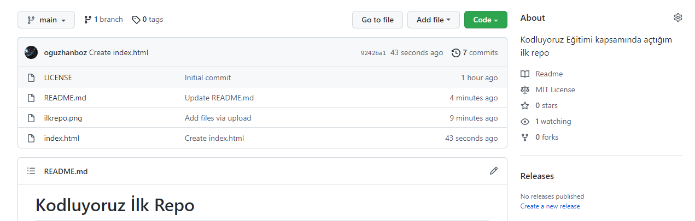

# Kodluyoruz İlk Repo
Kodluyoruz Eğitimi kapsamında açtığım ilk repo. İçinde bir adet README dosyası, bir adet de index.html barındırıyor.

## Installation
Öncelikle projeyi clonelayın.

https://github.com/oguzhanboz/kodluyoruzilkrepo.git
## Usage
Projeyi cloneladıktan sonra Visual Studio Code programında açınız.
## Contributing
Pull requestler kabul edilir. Büyük değişiklikler için, lütfen önce neyi değiştirmek istediğinizi tartışmak için bir konu açınız
## License
MIT
